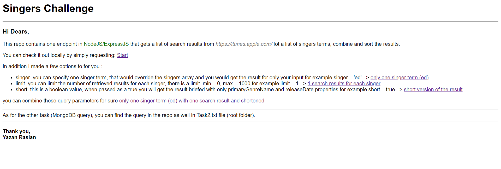
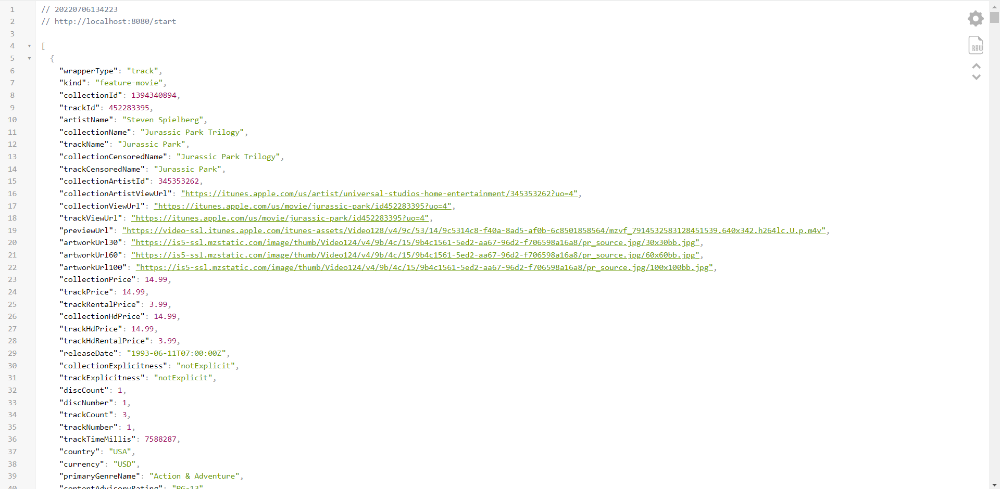
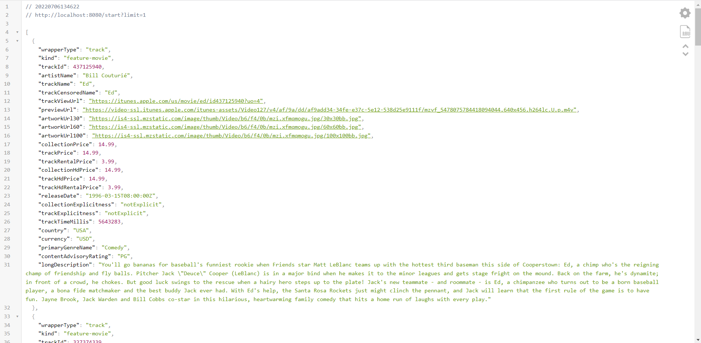
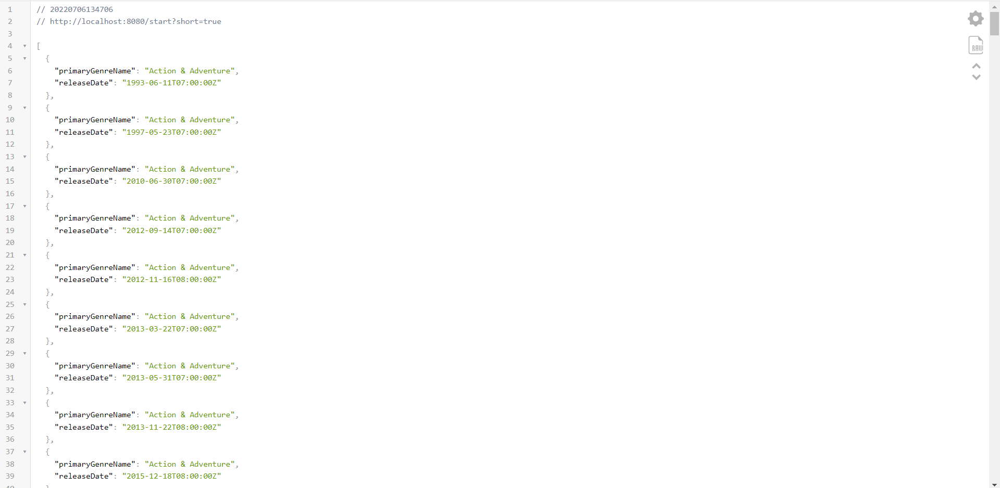
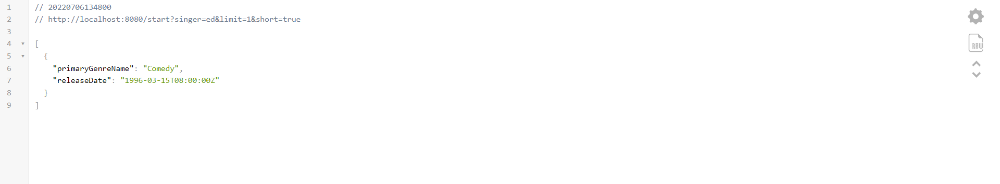

# singers-challenge

## Task 1
1. clone
2. npm i
3. run server locally (npm start)
### Main page (http://localhost:8080)

### Result

### One Singer Term (ed)

### Limit 1

### Shortened

### Term (ed) limit 1 shortened

## Task 2
### MongoDB Query
> db.items.aggregate( [ { $unwind: "$sizes" }, { $group: { "_id": { $toUpper: "$sizes" }, "averagePrice": { $avg: "$price" } } }, { $sort: { "averagePrice": -1 } } ] )